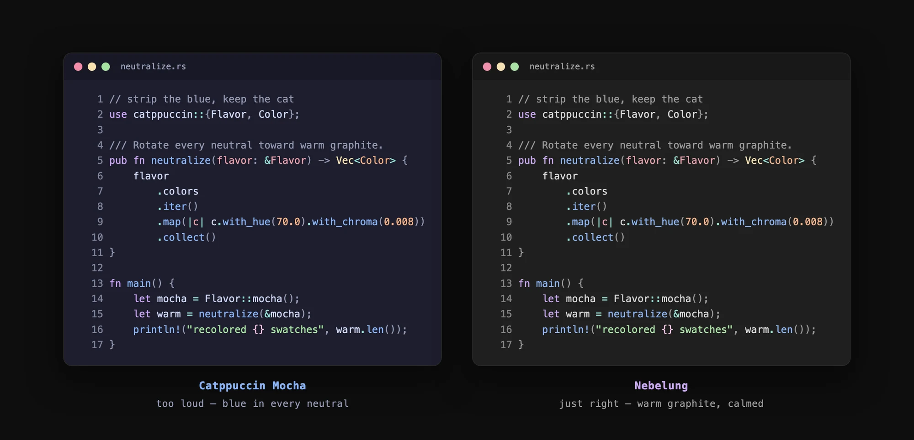
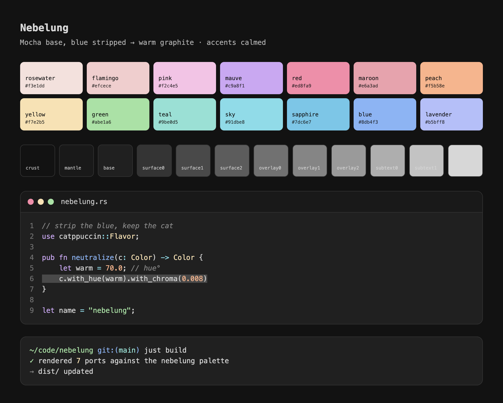

<div align="center">

<!-- palette-first hero: animated accent ramp, sorted by hue (assets/swatch-cascade.webp) — static fallback: assets/palette.png -->


A custom [Catppuccin](https://catppuccin.com) flavor — **Mocha with the blue stripped out**.


</div>

---

The entire Catppuccin neutral ramp (`base` → `text`) carries a single ~240° blue
hue. Nebelung rewrites that ramp to a **faint warm graphite grey**, keeping each
color's perceptual lightness identical, then **calms the 14 accents** (chroma ×0.9)
so they sit comfortably against neutral grey instead of a slightly-blue base.

Built with [whiskers](https://whiskers.catppuccin.com): the palette is a
`--color-overrides` file applied to the upstream `mocha` slot of each port's
template, so ports stay in sync with Catppuccin upstream and only the colors change.

<!-- S17 — loud-vs-right: same file in bat, upstream Mocha vs Nebelung (assets/loud-vs-right.webp) -->
<div align="center">

<br>
<sub>the same file in <code>bat</code> — upstream <b>Catppuccin Mocha</b> (blue in every neutral) beside <b>Nebelung</b> (warm graphite, calmed accents).</sub>
</div>

## Preview

[](https://htmlpreview.github.io/?https://github.com/nebelhaus/nebelung/blob/main/preview/nebelung.html)

<sub>▶ **[open the interactive preview](https://htmlpreview.github.io/?https://github.com/nebelhaus/nebelung/blob/main/preview/nebelung.html)** — the live swatch board + editor/terminal mockups, rendered straight from [`preview/nebelung.html`](preview/nebelung.html).</sub>

## Layout

```
palette/
  nebelung.json       # whiskers --color-overrides file (the source of truth)
  nebelung.hex.json   # flat name→hex map, for reference
scripts/
  generate-palette.mjs# regenerates the palette via OKLCH color math
templates/            # vendored upstream port .tera templates
dist/                 # rendered themes, ready to install
preview/nebelung.html # visual swatch + mockup, rendered through whiskers
ports.conf            # port manifest: name | template | output | extra args
build.sh              # render every port into dist/
```

## Usage

```bash
./build.sh             # regenerate palette + render all ports → dist/
./build.sh --no-gen    # render only (palette unchanged)
```

## Ports

| Port | Output in `dist/` | Install |
| --- | --- | --- |
| Ghostty | `ghostty/themes/catppuccin-mocha.conf` | copy into `~/.config/ghostty/themes/`, then `theme = catppuccin-mocha` |
| Kitty | `kitty/themes/mocha.conf` | copy into `~/.config/kitty/`, then `include mocha.conf` |
| Alacritty | `alacritty/catppuccin-mocha.toml` | import under `[general] import` in `alacritty.toml` |
| Starship | `starship/themes/mocha.toml` | merge into `~/.config/starship.toml` (or `palette = "mocha"`) |
| Zellij | `zellij/themes/nebelung.kdl` | copy into `~/.config/zellij/themes/`, set `theme "nebelung"` |
| btop | `btop/themes/catppuccin_mocha.theme` | copy into `~/.config/btop/themes/`, set `color_theme` |
| tmux | `tmux/themes/catppuccin_mocha_tmux.conf` | `source` it from `.tmux.conf` |
| bat | `bat/themes/Catppuccin Mocha.tmTheme` | copy into `$(bat --config-dir)/themes/`, `bat cache --build`, set `--theme` |
| delta | `delta/catppuccin.gitconfig` | `include` it from `~/.gitconfig`, set `features = catppuccin-mocha` |
| fzf | `fzf/themes/catppuccin-fzf-mocha.sh` (+ fish/nu/ps1/rc) | source it from your shell rc |
| lsd | `lsd/themes/catppuccin-mocha/colors.yaml` | copy as `~/.config/lsd/colors.yaml`, set `color.theme: custom` |
| yazi | `yazi/themes/mocha/catppuccin-mocha-<accent>.toml` | copy the accent you want as the flavor in `theme.toml` |
| lazygit | `lazygit/themes/mocha/<accent>.yml` | point `lg` config at it, or merge the `themes-mergable` variant |
| glow | `glow/catppuccin-mocha.json` | a glamour style — pass with `glow -s <path>` |
| zsh-syntax-highlighting | `zsh-syntax-highlighting/themes/…mocha….zsh` | source it before `zsh-syntax-highlighting.zsh` |
| Slack | `slack/README.md` | copy the comma-separated hex string → Slack ▸ Preferences ▸ Themes ▸ paste |
| Zen | `zen/themes/Mocha/<Accent>/userChrome.css` (+ `userContent.css`) | pick an accent folder, copy into your Zen `chrome/` dir |
| Obsidian | `obsidian/nebelung.css` | copy into a vault's `.obsidian/snippets/`, then enable under Settings ▸ Appearance ▸ CSS snippets (use the Default theme) |
| VS Code / Cursor | `vscode/settings.json` | merge into your user `settings.json` (needs the Catppuccin extension) |

VS Code uses the extension's native `catppuccin.colorOverrides` setting — no
build, the palette is just injected via settings. Set `catppuccin.accentColor`
yourself if you want a non-default accent.

## Nix

You don't need to install any of the above by hand if you consume this repo as
a flake — that's how the [nebelhaus](https://github.com/nebelhaus/nebelhaus)
rice themes everything:

```nix
inputs.nebelung.url = "github:nebelhaus/nebelung";
```

Two outputs:

- `packages.<system>.default` — the whole `dist/` tree, built reproducibly
  (no committed artifacts involved). Source files from
  `${nebelung.packages.<system>.default}/<port>/…`.
- `palette` — the raw `name → "#hex"` attrset, for configs Nix generates
  itself (a starship palette table, pounce's baked-in colors).

Inside the rice, picking an accent and applying it is a single option — see
[Theming & accents](https://nebelhaus.com/guides/theming/) on nebelhaus.com.

Hacking on the palette inside the wider rice? `haus try` in the
[workshop](https://github.com/nebelhaus/workshop) rebuilds your machine
against this local checkout — no push/re-lock loop. CI keeps the committed
`dist/` honest by rebuilding and diffing on every push.

### Tuning the palette

Edit the `CONFIG` block at the top of `scripts/generate-palette.mjs`:

| knob | meaning |
| --- | --- |
| `neutralHue` | hue (°) of the grey tint — 70 = warm |
| `neutralChroma` | how strong the tint is — bigger = more obvious |
| `accentChromaScale` | accent calming — 0.9 = 10% less saturated |

Re-run `node scripts/generate-palette.mjs` (or `./build.sh`) and re-open
`preview/nebelung.html` to judge.

## Requirements

- [`whiskers`](https://whiskers.catppuccin.com) — `brew install catppuccin/tap/whiskers`
- Node (for the palette generator)
